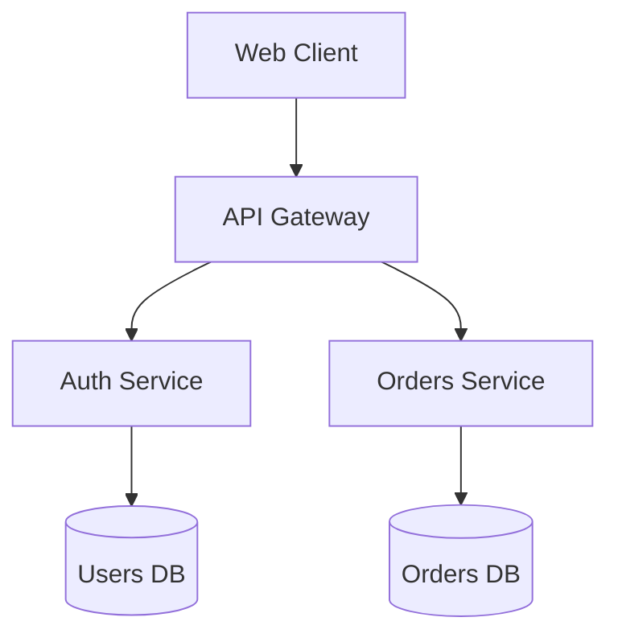

# Obsidian Vault (MCP)

This skill covers the Obsidian Local REST API's MCP tools (v2.x of the underlying `markdown-patch` engine). It exists mainly because `vault_patch` has a small but sharp algebra — get one field wrong and you either get a 400 or, worse, a silently-wrong edit (duplicated heading text, a mangled frontmatter type, a list item that became a whole new paragraph). Read this before calling `vault_patch`, especially the first time in a conversation.

## Tool map

| Tool | What it's for |
|---|---|
| `vault_list` | List files/subdirectories in a vault directory |
| `vault_read` | Read a note's content, frontmatter, tags, links, backlinks, stat |
| `vault_read_binary` | Read a non-text file (images, PDFs, etc.) as base64 |
| `vault_write` / `vault_write_binary` | Create or fully overwrite a file |
| `vault_append` | Append raw text to the end of a file |
| `vault_patch` | Targeted edit to one heading/block/frontmatter field |
| `vault_delete` | Delete a file (trash by default) |
| `vault_move` / `vault_copy` | Move or copy a file to a new path |
| `vault_get_document_map` | List a file's headings (as a tree), block ids, frontmatter keys, and its `version` token |
| `active_file_get_path` | Path of the file currently open in Obsidian |
| `search_query` | JsonLogic query over every note's metadata (frontmatter, tags, links, content, path, stat) |
| `search_simple` | Full-text search with match context |
| `tag_list` | All tags in the vault with usage counts |
| `command_list` / `command_execute` | List and run Obsidian commands (e.g. trigger a plugin action) |
| `open_file` | Open a note in the Obsidian UI |

**Reading:** use `vault_read` for anything text-based — it gives you content, frontmatter, tags, links, backlinks, and unresolvedLinks in one call, which is usually enough to plan an edit without a separate document-map fetch. Use `vault_read_binary` only for non-UTF-8 files (images, PDFs) — `vault_read` refuses those outright.

**Writing whole files:** `vault_write` overwrites unconditionally — read first if you need to preserve existing content. `vault_append` only ever adds to the end of the file, unstructured. For anything targeted (a specific section, a tag, a frontmatter field, a table row), use `vault_patch` instead — it's structured and far less likely to corrupt formatting.

## Before any non-trivial `vault_patch`, get the map

If you're editing a heading, a block, or need to be sure a frontmatter field exists, call `vault_get_document_map` first (or read the note with `vault_read`, which shows frontmatter and content — enough to spot headings by eye for simple cases). The map gives you three things you should not guess at:

1. **Exact heading text and nesting**, as a tree — the path you send as `target` must match this exactly, including capitalization and punctuation.
2. **Whether a heading or block id is duplicated.** If so, every occurrence after the first carries a non-printable marker suffix in its key. Copy that key verbatim out of the map response into your `target` — never retype or reconstruct it by hand.
3. **The `version` token**, which you can pass back as `ifMatch` to make your edit fail safely (`412`, file untouched) if someone changed the note in between your read and your write, instead of silently clobbering their change.

Skip the map only for simple, low-stakes cases: appending to a top-level heading you just read via `vault_read`, setting a frontmatter field you're confident exists or are creating fresh, or a plain `vault_append`.

## `vault_patch` in one page

Every patch is **operation** + **scope** (default `content`) + **target** (+ optional **within**) + exactly one payload field.

- **targetType**: `"heading"` | `"block"` | `"frontmatter"`
- **target**:
  - heading → **array** of heading texts from the top down, e.g. `["Projects", "Q3"]`. Never a `"Projects::Q3"` string. `null`/`[]` = document root.
  - block → the bare id, no `^` (e.g. `"2c7cfa"`, not `"^2c7cfa"`)
  - frontmatter → the key name
- **operation**: `"replace"` | `"prepend"` | `"append"` | `"delete"`
- **scope** (default `"content"`):
  - `content` — the body only. For a heading this is everything below the heading *line*. Never include the `#` heading line itself here.
  - `marker` — the label only (heading line text, block `^id`, or frontmatter key). `replace` here **renames** it.
  - `markerAndContent` — label + body together. For a heading, `replace` here rewrites the heading itself — if your replacement content has no leading `#`, the section stops being a heading at all. `prepend`/`append` insert a new sibling section before/after.
  - `parent` — only with `operation: "replace"`; moves a heading elsewhere in the tree (needs `destination`).
- **payload** — exactly one of:
  - `content` (string) — markdown text, or a rename
  - `value` (JSON) — frontmatter values, or table rows for a block target
  - `destination` — where a moved heading lands: `{"parent": [...] | null, "place": "first" | "last" | {"before": [...]} | {"after": [...]}}`
- **within** (heading targets only, optional): 0-based index (negative counts from the end, `-1` = last) into the section's direct body blocks. This switches the edit to a **literal splice into that block** — the only way to continue an existing list/paragraph instead of starting a new one below it. See "Continuing a list" below.
- **createTargetIfMissing** (bool): create the heading/block/frontmatter-key if absent.
- **rejectIfContentPreexists** (bool): fail instead of duplicating if the content is already there — useful for idempotent retries.
- **ifMatch**: the `version` token from a document map, for optimistic concurrency.

### Recipes

**Append a line under a heading:**
```json
{"targetType": "heading", "target": ["Log"], "operation": "append", "content": "New line of content"}
```

**Continue an existing list instead of starting a new block** (e.g. add a task to today's list under "Log"):
```json
{"targetType": "heading", "target": ["Log"], "within": -1, "operation": "append", "content": "\n- [ ] new item"}
```
`within` makes this a literal splice, so you own the leading `\n` — without it, your text glues onto the end of the last line instead of becoming a new list item. `-1` picks the last body block of the section (isolated `^id` lines don't count as blocks).

**Rename a heading** (keeps its level, body untouched — no `#` in `content`):
```json
{"targetType": "heading", "target": ["Overview", "Details"], "operation": "replace", "scope": "marker", "content": "New Name"}
```

**Set a frontmatter field** (typed value goes in `value`, not `content`):
```json
{"targetType": "frontmatter", "target": "status", "operation": "replace", "value": "in-progress", "createTargetIfMissing": true}
```

**Add a tag** (merges into the list; creates the field if the note has no tags yet):
```json
{"targetType": "frontmatter", "target": "tags", "operation": "append", "value": ["project/active"], "createTargetIfMissing": true}
```
There's no "remove one item" operation — to remove a tag, read the current list (`vault_read`), filter it in your own reasoning, and `replace` the whole field with what's left.

**Add a row to a table**, addressed by the table's block reference, as a 2-D array (each row's cell count must match the table's columns):
```json
{"targetType": "block", "target": "2c7cfa", "operation": "append", "value": [["Chicago, IL", "16"]]}
```

**Move a section elsewhere in the tree**, re-leveled automatically:
```json
{"targetType": "heading", "target": ["Overview", "Details"], "operation": "replace", "scope": "parent", "destination": {"parent": ["Appendix"], "place": "last"}}
```
`place` is `"first"`, `"last"`, `{"before": [...]}`, or `{"after": [...]}`; `"parent": null` moves it to the document root.

**Delete a section entirely** (vs. just clearing its body, vs. just dissolving the heading line — pick the scope that matches intent):
```json
{"targetType": "heading", "target": ["Heading 1", "Subheading 1:2"], "operation": "delete", "scope": "markerAndContent"}
```

**Relative heading levels**: a leading `#` in `content` is always relative to where it lands — never count absolute levels yourself. Nesting inside your content is preserved as written (`# New\n\n## Child` under a `##` target becomes `## New` / `### Child`).

**Whitespace**: leading/trailing blank lines in `content` are stripped and irrelevant — don't pad with `\n` to control spacing, the engine supplies separating blank lines automatically wherever your content meets existing body text. The one exception is a `within`-targeted literal splice, where you do own the joint (see the list-continuation recipe above).

For the full instruction algebra including raw-content/templating mode, HTML-error mapping, and the deprecated 1.x header format, see `references/patch-algebra.md` — you generally won't need it for MCP tool calls, since the MCP `vault_patch` tool only speaks the current JSON-instruction shape.

## Searching the vault

- **`search_simple`**: full-text search. Takes a plain query string and returns matching files with match offsets and surrounding context. Good default for "find notes mentioning X."
- **`search_query`**: structured search via JsonLogic evaluated against each note's metadata (same shape as `vault_read`'s output: `frontmatter`, `tags`, `path`, `content`, `links`, `backlinks`, `unresolvedLinks`, `stat`). Use this for anything a text search can't express precisely — filtering by frontmatter value, tag membership, or a glob/regex pattern. Two extra operators beyond standard JsonLogic: `glob: [pattern, value]` and `regexp: [pattern, value]`.

  Find notes with a specific tag:
  ```json
  {"in": ["project/active", {"var": "tags"}]}
  ```
  Find notes by a frontmatter field:
  ```json
  {"==": [{"var": "frontmatter.status"}, "in-progress"]}
  ```
  Only non-falsy results are returned (so a query that resolves to `false`, `null`, `0`, `[]`, or `{}` for a note excludes it).

- **`tag_list`**: use this first when the user asks about tags in the abstract ("what tags do I use", "how many notes are tagged X") rather than searching note-by-note.

Bulk operations (e.g. "add a field to every note tagged X") are `search_query` to get the file list, then one `vault_patch` per file — there's no batch-patch tool, so do them in a loop and report which files were touched.

## Other tools, briefly

- **`vault_list`**: pass a directory path (or none for the vault root) to list files and subdirectories. Directories are returned with a trailing `/`.
- **`vault_move` / `vault_copy`**: take source and destination paths. Moving preserves link integrity (Obsidian updates references); copying does not rewrite links in the copy.
- **`vault_delete`**: moves to trash by default rather than permanently deleting — mention this to the user if they're expecting a hard delete, and only pass permanent-delete if they've been clear that's what they want.
- **`active_file_get_path`**: use when the user says "this note" or "the current file" without naming a path — resolve it first, then treat it like any other vault path for subsequent calls.
- **`command_list` / `command_execute`**: for actions outside the file-editing model — e.g. triggering a plugin command, opening a specific view, running a template insertion the user has bound to an Obsidian command. List first if you're not sure of the exact command id; ids look like `"global-search:open"`.
- **`open_file`**: opens a note in the Obsidian UI itself (not just returning its content) — use when the user wants to *see* the result in the app, e.g. after creating a new note.

## File naming, organization, and tagging conventions

These are this vault's conventions — apply them by default whenever creating, renaming, moving, or tagging a note, without asking each time. (If the user asks for something that conflicts with a rule here, follow their explicit instruction for that note — these are defaults, not hard constraints.)

### Naming files

- **Plain, descriptive titles.** `Project Kickoff Notes.md`, not `2026-09-02-project-kickoff-notes.md` or `project_kickoff_notes.md`. Title Case, spaces, no dates or IDs baked into the filename — the one exception is daily/journal notes, where the date *is* the identity of the note (e.g. `2026-09-02.md` inside a dated journal folder).
- **No characters that need escaping.** Avoid `/`, `:`, `#`, `^`, `[[`, `]]`, and other markdown/link syntax in filenames — they either don't resolve as vault paths or need percent-encoding to address later, which is friction for no benefit. A colon in a title ("Meeting: Q3 Planning") should become a dash or just be dropped ("Meeting - Q3 Planning").
- **Check before creating.** Before creating a new note, `vault_list` the target folder (or `search_simple` the working title) to catch near-duplicates — "Project Kickoff Notes" vs. "Project Kickoff" vs. "Kickoff Meeting Notes" all fragment the same topic across three files if nobody checks first.
- **The title is the H1, generally.** For non-journal notes, the filename and the note's first heading should usually match (or the heading can be omitted and the filename stands alone as the title, per the user's existing style — check a couple of existing notes in the target folder to see which pattern is already in use before picking one).

### Folder organization: PARA

This vault uses PARA (Projects / Areas / Resources / Archive). Route new notes by asking what the note *is*, not just what it's about:

| Folder | What goes here | Signal |
|---|---|---|
| **Projects/** | Notes tied to a specific outcome with an end date | "This is done when X happens" |
| **Areas/** | Ongoing responsibilities with no end date | "This needs to stay maintained indefinitely" |
| **Resources/** | Reference material, topics of interest, not tied to a project or responsibility | "I might want to look this up later" |
| **Archive/** | Anything from Projects or Areas that's no longer active | "This is done or dormant" |

When a project finishes or a note goes stale, move it into `Archive/` (`vault_move`) rather than leaving it live in `Projects/`/`Areas/` — that's what keeps PARA useful instead of just another set of folders that accumulates cruft. If it's genuinely unclear which bucket a new note belongs in, ask rather than guessing — miscategorized notes are exactly the kind of thing that's annoying to notice and fix later.

### Metadata: frontmatter for facts, tags for themes

To keep this clean, split structured and flexible metadata rather than cramming everything into tags:

- **Frontmatter properties** carry structured, queryable facts about the note — the things you'd want to filter or sort on with `search_query`. A consistent minimal schema per note type, e.g.:
  ```yaml
  ---
  type: project        # project | area | resource | daily
  status: active        # active | on-hold | done | archived
  area: Health          # which Area this relates to, if any
  ---
  ```
  Keep the field set small and consistent across similar notes — check an existing note of the same type before inventing a new field name for something a field probably already covers.
- **Tags** are for cross-cutting themes that don't map to a folder or a frontmatter value — the kind of thing a note might share with otherwise-unrelated notes across every PARA bucket (e.g. `#waiting-on`, `#needs-review`). Keep nesting shallow (one level is usually enough, e.g. `#waiting-on/alex` rather than three or four levels deep) and keep the tag vocabulary small — before adding a new tag, `tag_list` to check whether an existing one already covers it. If you find yourself wanting a tag that's really just "what kind of note is this" (project/area/resource), that's a `type` frontmatter field instead, not a tag — that distinction is what keeps tags from turning into a second, messier folder system.

### Quick pre-flight checklist

Before creating or restructuring anything, worth a fast pass through:
- Does a note like this already exist? (`vault_list` the folder / `search_simple` the title)
- Which PARA bucket does it actually belong in?
- Does the filename need any characters cleaned up?
- Does an existing frontmatter field or tag already cover what I'm about to add, per `tag_list` / a sibling note's frontmatter?

## Writing documentation, overviews, and architecture notes

Applies whenever creating or substantially editing a note whose job is to explain something — an architecture overview, a system doc, a decision record, a how-to/runbook. The goal is documentation that's easy to scan, stays accurate as it's edited piecemeal over time, and takes advantage of the fact that everything here is plain text a tool (or a person) can patch into precisely.

### Diagrams: Mermaid, not images

Obsidian renders Mermaid code blocks natively in preview — use them instead of pasting screenshots or ASCII art. Being plain text means a diagram can be created and *edited* the same way as any other section (`vault_patch` a code block like any other block), rather than requiring an external tool and a re-upload every time something changes. Pick the diagram type to match what's actually being shown, rather than defaulting to a flowchart for everything:

| Need | Diagram | Mermaid type |
|---|---|---|
| Steps in a process, decision branching | Flowchart | `flowchart TD` / `flowchart LR` |
| Requests/calls between components over time | Sequence diagram | `sequenceDiagram` |
| Data model, entities and their relationships | ER diagram | `erDiagram` |
| Lifecycle or status transitions | State diagram | `stateDiagram-v2` |
| Component structure, classes, interfaces | Class diagram | `classDiagram` |
| Timeline, project phases | Gantt | `gantt` |

Example — a component architecture as a flowchart:
````markdown

````
Keep diagrams small and focused — one diagram per concern (e.g. a request-flow sequence diagram *and* a separate data-model ER diagram) reads far better than one diagram trying to show everything at once.

### Callouts for anything that isn't plain narrative

Obsidian's callout syntax makes warnings, decisions, and open questions visually distinct instead of getting lost in a paragraph:
```markdown
> [!important] Decision
> We chose Postgres over Mongo for the orders table because of transactional guarantees across order + payment writes.

> [!warning]
> This service still reads from the legacy cache — do not remove it until MIGRATE-142 lands.

> [!question] Open question
> Should retries be idempotent at the API layer or the queue consumer?
```
Common types: `note`, `tip`, `important`, `warning`, `question`, `example`, `quote`. Use them sparingly enough that they stay meaningful — a doc that's all callouts is as hard to scan as one with none.

### Structural templates

Fixed skeletons make a doc both easier to read (readers know where to look) and easier to maintain (headings are stable targets for future `vault_patch` calls). Default to these unless the user has an existing pattern in the vault worth matching instead — check a sibling doc first.

**Architecture / system overview:**
```markdown
# [System Name]

## Overview
One paragraph: what this is and why it exists.

## Architecture
[diagram + component descriptions]

## Key decisions
[notable decisions and their rationale — or link to ADRs]

## Dependencies
[what this relies on, what relies on it]

## Open questions
[unresolved things, explicitly flagged rather than silently omitted]
```

**Architecture Decision Record (ADR)**, one per significant decision, useful once a project has more than a couple of them:
```markdown
# [Short decision title]

## Status
Proposed | Accepted | Superseded by [[...]]

## Context
What's the situation forcing this decision?

## Decision
What was decided.

## Consequences
What this makes easier, what it makes harder.
```

**Runbook / how-to:** a numbered `## Steps` section with one action per heading or list item, plus a `## Troubleshooting` section for known failure modes — written for someone under time pressure, so lead with the action, not the background.

### Linking instead of duplicating

- **Wikilinks** (`[[Note Name]]`) between related docs — link to the auth service doc from the orders service doc instead of re-explaining auth inline.
- **Embeds** (`![[Note Name#Heading]]`) to pull a section from one note into another so it's written once and stays current everywhere it's referenced, instead of copy-pasted and silently drifting out of sync.
- **MOCs (Maps of Content)** — for a documentation set with more than a handful of notes, keep one index note per area that links out to everything in it, organized by theme rather than alphabetically. This is usually worth creating proactively once a `Resources/` or `Areas/` folder starts accumulating related docs — check with `vault_list` and suggest one if it's missing.

### Heading hygiene (this one has a practical payoff, not just looks)

Keep headings unique within a document and reasonably shallow (rarely deeper than H3-H4) — beyond being easier to scan, this is exactly what keeps `vault_patch` heading-targeting reliable: duplicate sibling headings force addressing by non-printable marker suffix instead of plain text, and deep nesting makes `target` arrays longer and more brittle to keep in sync as the doc evolves. If a section is getting deep enough to need H5/H6, it's usually a sign the doc wants to be split into linked sub-notes instead.

### Tables and code blocks over prose, where structure is the point

- A table beats a paragraph for anything that's really rows and columns in disguise — config options, API parameters, comparison of approaches. Three or more parallel items with the same 2-3 attributes each is a table, not a bulleted list.
- Fenced code blocks with a language tag (` ```yaml `, ` ```python `, ` ```bash `) for anything that is code, config, or a command — never inline or unlabeled, since syntax highlighting and copy-ability both depend on it.

### Extra frontmatter fields for documentation notes

On top of the `type`/`status`/`area` schema from the section above, docs benefit from a couple more fields worth setting consistently:
```yaml
---
type: architecture
status: current        # current | draft | outdated
related:
  - "[[Orders Service]]"
  - "[[Auth Service]]"
last-reviewed: 2026-09-02
---
```
`related` gives `search_query` something structured to traverse for "what else touches this" queries beyond just backlinks; `last-reviewed` makes stale docs easy to find later (`search_query` for anything older than N months) rather than silently rotting.

## General judgment

- Prefer `vault_patch` over `vault_write` whenever the user's request targets part of a note — it's structured, so it can't accidentally mangle the rest of the file the way a full-content rewrite might if your read-modify-write logic slips.
- When a request is ambiguous about *where* something should go (which heading, which note), read the note or list the directory first rather than guessing a path or section name.
- For any multi-file bulk edit, briefly summarize the plan (which files, what change) before executing, since these aren't easily undoable beyond Obsidian's own file history/trash.
